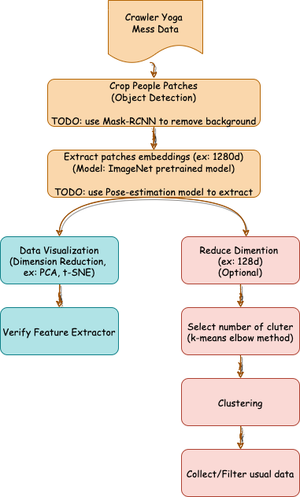
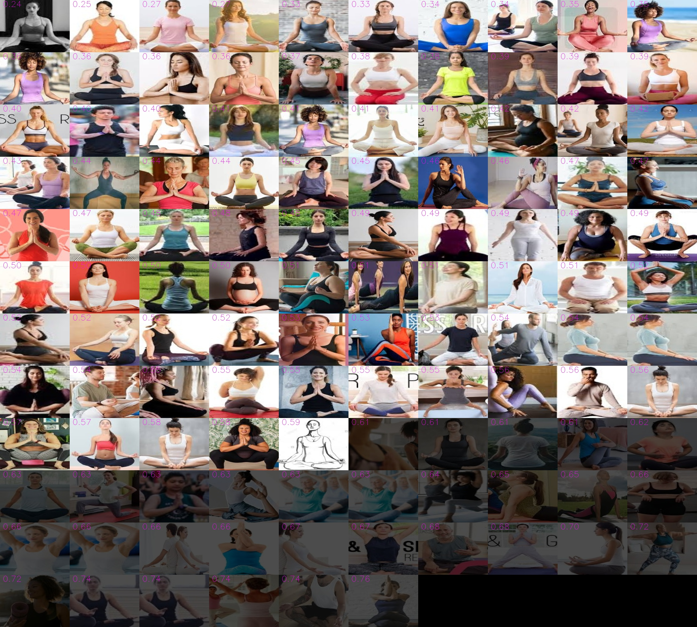
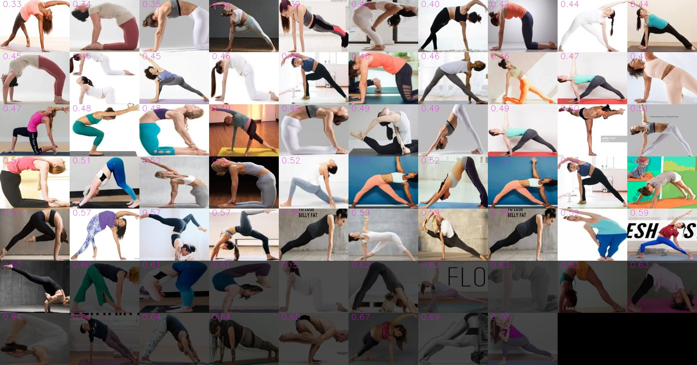
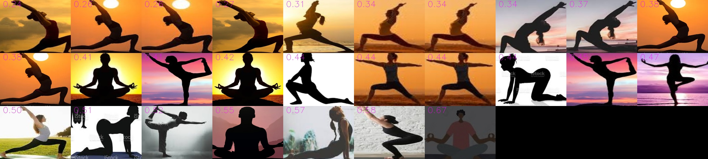

# Filter and collect data via unsupervised learning

## Motivation
Is possible to collect/filter useful data via unsupervised learning approach to save manual checking time?

## Pipeline
Cluster the Yoga crawler mess data to collect grouping data




## Sample Result

### Data Visualization - t-SNE

The Seated Yoga Poses group together in the upper middle part of the picture.

```
TODO: 
Try to use pose-estimation instead of ImageNet pretrained model to extract people embeddings
```


### Clustering samples - k-means

Filter out the outlier(fused with black image) with larger cosine distance

```
TODO: 
Try to use Mask-RCNN to crop people to remove background noise
```

- 

- 

- 

## How to run
- In Tensorflow2.x

- Collect the mess data
    - [Sample Yoga Crawler Mess Poses](https://drive.google.com/drive/folders/1zpQSWee4G_RgXFU0HeMcIcL0CiOLDghc)
```
$ python main.py --data_path your_crawler_mess_poses
```

## Conclusion

Maybe we can try to use segmentation to remove people background noise and use pose-estimation to extract good embeddings to get better results in the future.


